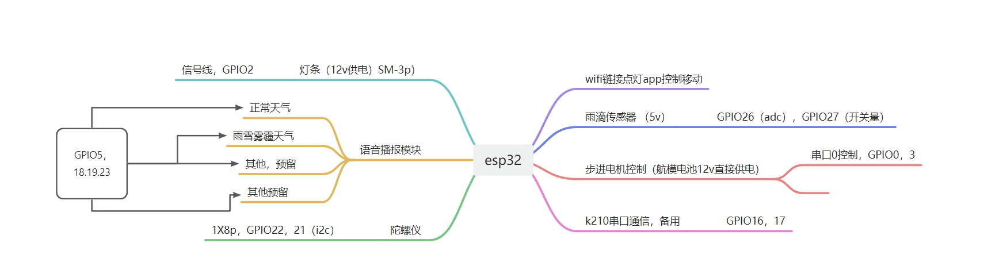
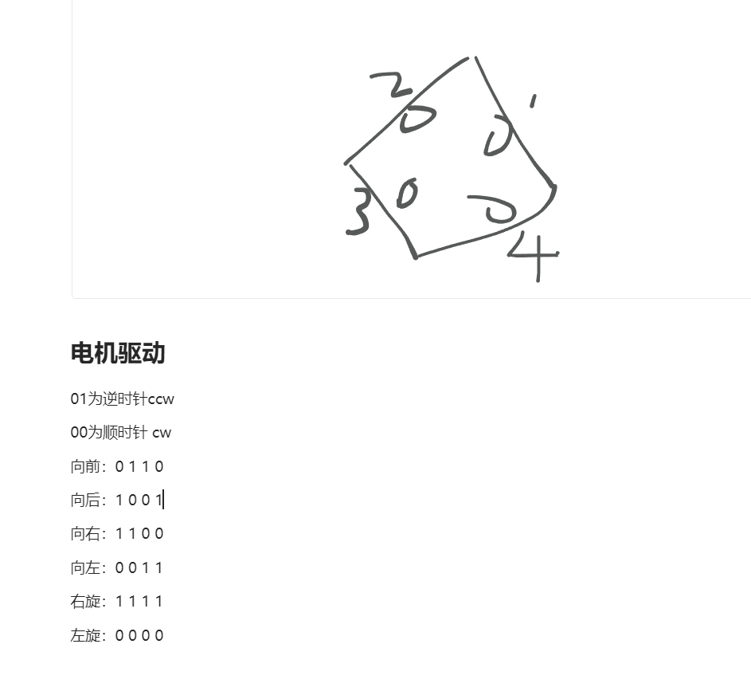

# Uwb-mobile-warning-sign

#### 介绍
{**以下是 Gitee 平台说明，您可以替换此简介**
Gitee 是 OSCHINA 推出的基于 Git 的代码托管平台（同时支持 SVN）。专为开发者提供稳定、高效、安全的云端软件开发协作平台
无论是个人、团队、或是企业，都能够用 Gitee 实现代码托管、项目管理、协作开发。企业项目请看 [https://gitee.com/enterprises](https://gitee.com/enterprises)}

#### 软件架构
软件架构说明

#### 安装教程

xxxxxx

#### 使用说明

1.  本项目基于esp32开发，通过uwb实现警示牌精确定位。
2.  未经本人允许，禁止用于商业用途！

#### 参与贡献

1.  xxxxxx

#### 演示视频

<video src="【Uwb mobile warning sign】 https://www.bilibili.com/video/BV1vC4y1d7iW/?share_source=copy_web&vd_source=59d27872ea6a7ea7390ac0fae3dc29bd"></video>
